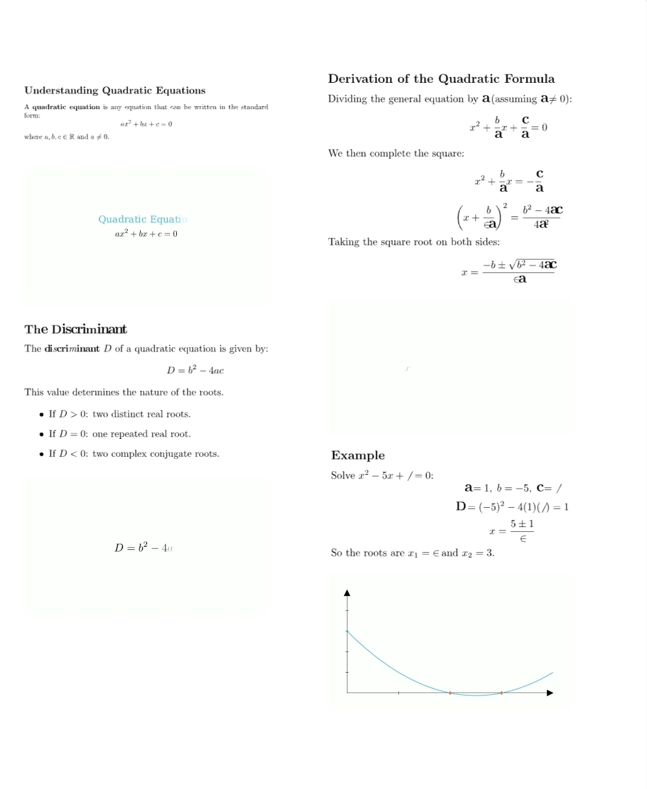

# Pandora Document System

Pandora is a **smart, interactive document format** that merges **LaTeX mathematics**, **Manim animations**, **images**, and **videos** into a single portable `.pandora` file.

It’s designed for **education**, **visual notes**, and **concept illustration** — perfect for math, physics, and engineering topics (e.g., CBSE/JEE materials).



---

## ✨ Key Features

### 1. Full LaTeX Support

Pandora uses a modern LaTeX renderer that compiles each snippet into a **crisp SVG**.
Supports:

* All AMS math environments
* Custom theorem boxes (Definition, Example, Question, Answer)
* Colorized section headings
* Unicode, math symbols, and inline equations

Each LaTeX block is auto-styled using the **Pandora LaTeX Theme** — a consistent, beautiful, Times-style design with custom boxes and colors.

---

### 2. Manim Integration

You can embed **Manim scenes** directly using special code blocks.
Pandora compiles each scene separately, generates a video, and embeds it inline.

This makes it possible to create dynamic, animated explanations right beside your equations.

---

### 3. Images & Videos

Supports including images and video clips with optional sizing and scaling.

---

### 4. Page Layouts

Documents support:

* `single-column` (default)
* `two-column` (automatically detected from `\twocolumn` or `%% twocolumn`)

---

### 5. Modern Viewer

The `viewer.html` file provides:

* Scrollable pages with drop shadows
* Floating **+** button to open or save `.pandora` files
* Smooth **zoom in/out controls**
* **Auto-hide top bar** that reappears on scroll-up
* Works perfectly on **mobile and desktop**

---

## Pandora LaTeX Styling

Pandora uses a global preamble automatically applied to all LaTeX code blocks.

### Color Palette

| Element | Color     | Description                         |
| ------- | --------- | ----------------------------------- |
| Accent  | `#007ACC` | Primary highlight color             |
| Blue    | `#1E90FF` | For examples and secondary headings |
| Gray    | `#555555` | For neutral boxes and notes         |
| Green   | `#00AA00` | For answers and correct results     |

### Custom Box Environments

The system defines several stylized boxes for structured content:

`\begin{definitionbox} ... \end{definitionbox}`
→ For definitions or laws.

`\begin{examplebox} ... \end{examplebox}`
→ For examples and worked-out cases.

`\begin{questionbox} ... \end{questionbox}`
→ For practice questions or exercises.

`\begin{answerbox} ... \end{answerbox}`
→ For step-by-step solutions or results.

Each box has subtle background colors and rounded borders for readability.

---

### Custom Section Formatting

Pandora auto-styles section titles:

* `\section{Topic}` → Large, bold, accent-colored
* `\subsection{Subtopic}` → Smaller, blue-highlighted

---

## Pandora Document Syntax

Pandora `.tex` files use **special inline commands** that get parsed into different media types.

### LaTeX Block

Any standard LaTeX text is compiled into SVG.

```
\section{Quadratic Equations}
The general form is \( ax^2 + bx + c = 0 \).
```

---

### Manim Block

Create a block using:

```
\begin{manim}
self.play(Write(MathTex("x^2 + bx + c = 0")))
self.wait(1)
\end{manim}
```

⚠️ **Note:** Do *not* include `import manim` or class definitions — they’re automatically wrapped inside a scene class.

---

### Inline Manim (Quick Snippet)

You can also include short one-liners inline:
`\manim{self.play(Create(Square()))}`

---

### Images

`\image[width=80%]{diagram.png}`

### Videos

`\video[scale=0.5]{motion.mp4}`

---

### Page Breaks

Use:
`\newpage`
or
`%% pagebreak`
to start a new page.

---

## Building a Pandora File

Run:
`python create.py example.tex -o output.pandora`

This will:

1. Parse your `.tex` document
2. Render each LaTeX block as SVG
3. Render each Manim scene as MP4
4. Copy all media and metadata
5. Zip into a single `.pandora` file

---

## Viewing Pandora Files

1. Open `viewer.html` or [Pandora](https://pandora.vyxm.in) in a browser and navigate to NoteReader.
2. Click the **+** button to load your `.pandora` file.
3. Scroll, zoom, or switch pages.
4. Works offline — no server required.

---

## Example Workflow

1. Create a LaTeX file like this:

```
%% twocolumn
\section{Quadratic Equations}
\begin{definitionbox}
A quadratic equation is of the form \( ax^2 + bx + c = 0 \), where \( a \ne 0 \).
\end{definitionbox}

\begin{manim}
self.play(Write(MathTex("x^2 + bx + c = 0")))
self.wait(1)
\end{manim}

\begin{questionbox}
Find the roots of \( x^2 - 5x + 6 = 0 \).
\end{questionbox}

\begin{answerbox}
Using factorization: \( (x - 2)(x - 3) = 0 \Rightarrow x = 2, 3 \).
\end{answerbox}
```

2. Compile to Pandora:
   `python create.py quadratic.tex -o quadratic.pandora`

3. Open `quadratic.pandora` in the viewer and enjoy your interactive document.

---

## Notes and Tips

* Keep LaTeX code clean — don’t include full document headers.
* You can use MathJax fallback if LaTeX SVG rendering fails.
* Manim videos are muted by default and autoplay in loops.
* To change layout to two-column, add `%% twocolumn` near the top of your `.tex`.

---

## File Structure (Inside `.pandora`)

```
meta.json             → document layout + sequence
latex/block_0.svg     → compiled LaTeX blocks
videos/scene_0.mp4    → rendered Manim scenes
images/...            → linked image files
```

---

## Future Plans

* Live code/animation preview
* Markdown + LaTeX hybrid support
* Interactive questions (MCQs)
* Theming system with alternate colors

---

## Credits

Developed for education and visualization by **Vyom Nishant Patel**.
Created with ❤️ to make math more intuitive and beautiful.

---
